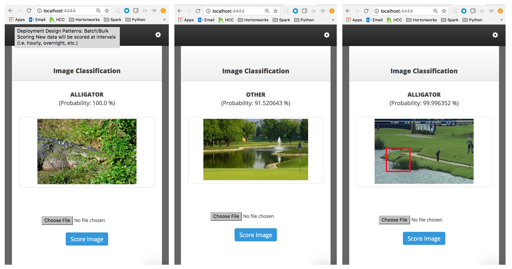

<h3>Image Classification</h3>
Deep Learning Image Classification - Scripts and Links
 
 <b>References:</b>
 &nbsp;&nbsp;&nbsp;&nbsp;&bull;&nbsp;<a href="https://keras.io/preprocessing/image/">Keras Image Processing</a>
 &nbsp;&nbsp;&nbsp;&nbsp;&bull;&nbsp;<a href="https://github.com/databricks/spark-deep-learning#transfer-learning">Spark Deep Learning</a>
 &nbsp;&nbsp;&nbsp;&nbsp;&bull;&nbsp;<a href="https://elitedatascience.com/keras-tutorial-deep-learning-in-python">Keras Overview</a>
 
