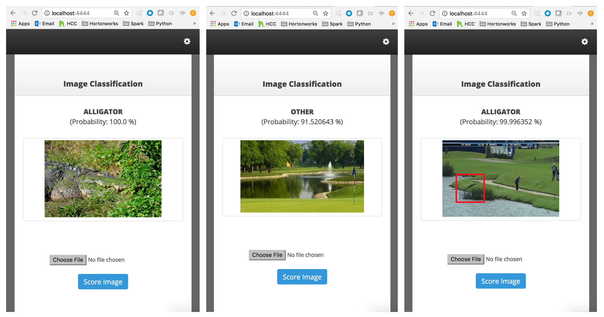

<h3>Deep Learning Image Classification</h3>
Projects, Scripts, and Links
 
 
 <b>To Run WebApp:</b>
 &nbsp;&nbsp;&nbsp;&nbsp;1) Clone Repo
 &nbsp;&nbsp;&nbsp;&nbsp;2) <code>cd DL_Image_Classification/docker</code>
 &nbsp;&nbsp;&nbsp;&nbsp;3) <code>./build.sh</code>
 &nbsp;&nbsp;&nbsp;&nbsp;4) <code>./run_image_classification.sh</code>
 &nbsp;&nbsp;&nbsp;&nbsp;5) Open up browser and go to http://localhost:14444
 
 
 <b>References:</b>
 &nbsp;&nbsp;&nbsp;&nbsp;&bull;&nbsp;<a href="https://keras.io/preprocessing/image/">Keras Image Processing</a>
 &nbsp;&nbsp;&nbsp;&nbsp;&bull;&nbsp;<a href="https://github.com/databricks/spark-deep-learning#transfer-learning">Spark Deep Learning</a>
 &nbsp;&nbsp;&nbsp;&nbsp;&bull;&nbsp;<a href="https://elitedatascience.com/keras-tutorial-deep-learning-in-python">Keras Overview</a>
 &nbsp;&nbsp;&nbsp;&nbsp;&bull;&nbsp;<a href="https://thenewstack.io/tips-tricks-develop-deep-learning-using-apache-spark/">Deep Learning with Spark Considerations</a>
 
 
